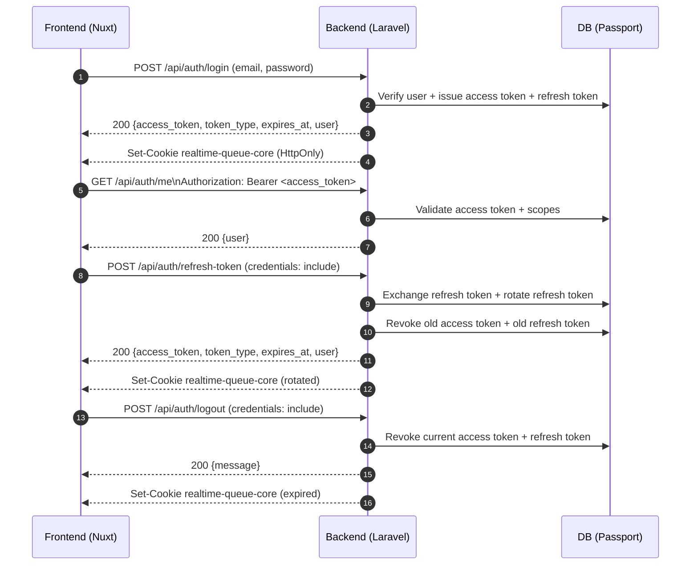

# Nuxt + Laravel Passport Refresh Token Setup

## Overview

This project is configured with the following authentication model:

- Nuxt stores the `access_token` on the client side.
- Laravel Passport issues both the `access_token` and the `refresh_token`.
- The `refresh_token` is never exposed to JavaScript. The backend stores it in an HttpOnly cookie named `realtime-queue-core`.
- When the frontend requests a refresh, the backend uses Passport's `refresh_token` grant, rotates the refresh token cookie, and revokes the old tokens.

## Sequence Diagram



## Backend Endpoints

- `POST /api/auth/register`
- `POST /api/auth/login`
- `POST /api/auth/refresh-token`
- `GET /api/auth/me`
- `POST /api/auth/logout`

## Files Updated

- `bootstrap/app.php`: registers `routes/api.php`
- `routes/api.php`: auth API routes
- `app/Http/Controllers/Api/AuthController.php`: login, register, refresh, logout flow
- `config/cors.php`: enables credentialed CORS for Nuxt
- `frontend/app/composables/useAuth.ts`: access token state, auto refresh, logout
- `frontend/app/pages/index.vue`: frontend auth demo page
- `frontend/nuxt.config.ts`: `NUXT_PUBLIC_API_BASE` support

## Required Environment Variables

### Laravel `.env`

Add or update the following values:

```env
APP_URL=http://127.0.0.1:8000

PASSPORT_PASSWORD_CLIENT_ID=your-password-client-id
PASSPORT_PASSWORD_CLIENT_SECRET=your-password-client-secret

CORS_ALLOWED_ORIGINS=http://localhost:3000,http://127.0.0.1:3000
SESSION_DOMAIN=null
SESSION_SAME_SITE=lax
SESSION_SECURE_COOKIE=false
```

### Nuxt `.env`

Create `frontend/.env` if needed:

```env
NUXT_PUBLIC_API_BASE=http://127.0.0.1:8000/api
```

## Passport Password Grant Client

This flow depends on a Laravel Passport password grant client. If you do not have one yet, create it with:

```bash
php artisan passport:client --password
```

Then copy the generated values into:

- `PASSPORT_PASSWORD_CLIENT_ID`
- `PASSPORT_PASSWORD_CLIENT_SECRET`

## Local Run Order

### Backend

```bash
php artisan migrate
php artisan serve
```

### Frontend

```bash
cd frontend
npm install
npm run dev
```

## Frontend Behavior

- Login/Register: sends credentials to the backend, receives an `access_token`, and stores it in browser state.
- Protected requests: automatically send `Authorization: Bearer <access_token>`.
- On `401`: the frontend automatically calls `POST /api/auth/refresh-token`.
- Successful refresh: updates the access token and retries the original request once.
- Logout: calls the backend to revoke tokens and clears frontend auth state.

## Security Notes

- The `refresh_token` is not exposed to JavaScript.
- The refresh cookie is `HttpOnly`.
- The old access token and old refresh token are revoked after a successful refresh.
- This is a token-based SPA flow for separated frontend/backend applications, not session authentication.

## Important Limitation

For the flow to work, the backend must have a valid Passport password grant client configured in both the database and `.env`.

If `PASSPORT_PASSWORD_CLIENT_ID` or `PASSPORT_PASSWORD_CLIENT_SECRET` is missing, the auth API will return a configuration error.
